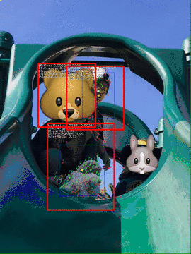
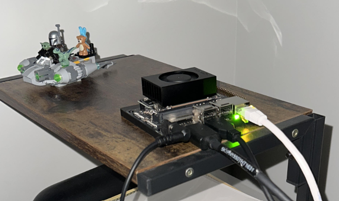
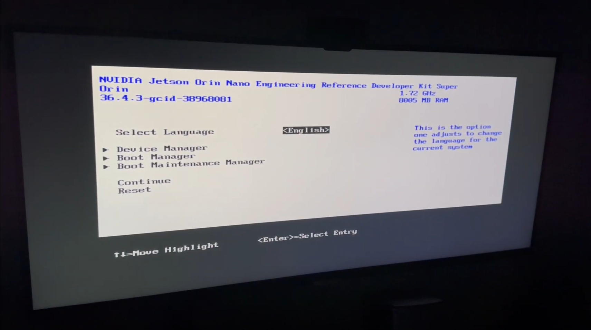
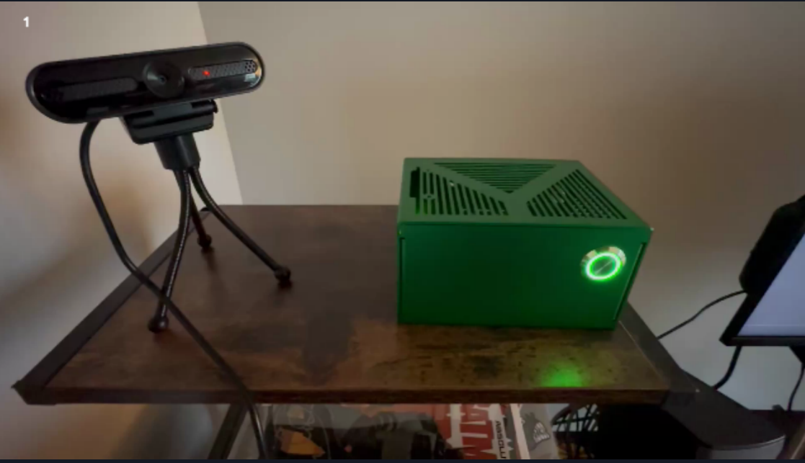

# Introduction

Intro: Throughout the course of our studies at Full Sail University in the Computer Science Masters of Science with a focus on AI, we have been challenged to learn and perform a pace we often did not believe would be possible. This was a true real world educaction in the sense that it forced us to perform at a level we did not realize was possible. The courswork demanded our attention on a daily basis and to be successful we often worked up until the last moment of the deadline to submit our work on time. This was a challenge that brought us to gain a deep understanding of concepts like machine-learning, computer vision, statistical modeling, feature engineering, and more. This required a new level of discipline and many sacrifices to accomplish. It seemed life was hitting harder and harder until finally one day, it all paid off. We finnally made it to the Capstone Project and our presentation was accepted for development! We are excited to share the progress of our work and the challenges we faced along the way. In the future we hope to create a more robust version of our software while also reducing the resources required for it to perform. As AI becomes more embedded into everyday life the amount of electricity and processing power required for this technology to work continues to grow. While this need fuels investment in infrastructure it should also be approached as a problem. We hope that through our research and development efforts we can improve the efficiency of our application by at least 1%. 

## Recent Presentation

  

    
    
    
    
    
    
    
    
    
    
    
    
    
    
    
    
  

  
  <button class="prev" onclick="changeSlide(-1)">❮</button>
  <button class="next" onclick="changeSlide(1)">❯</button>
  
  

    1 / 16
  

## Monthly Development Blog

  <h3 class="post-title">Action Recognition Modeling and Integration</h3>
  
June 1, 2025 • By JCP

  
  <h4>Features Developed This Month</h4>
  
This month we developed a system to create and train action recognition models using MediaPipe, PyTorch, SciKitLearn and data augmentation techniques to produce accurate models with less than 50 samples. Google provides a demo library for Mediapipe which allows us to create the required tracking landmarks we need to record action data. Source : https://github.com/google-ai-edge/mediapipe. We were able to introduce the model we trained along with our new action recognition pipeline into the main application that performs object detection called "EyeSpy+".

  
  

    
    
Action Recognition Trainer with skeleton wireframe

  

  <h4>Retrospective</h4>
  
  <h5>What went right this month?</h5>
  
This month we were fortunate to have a lot of time available to dedicate to our project due to our work schedule opening up time for us to work on our studies. Knowing how challenging it is to annotate images for model training from a previous project, we decided to make this the focus of the effort. Our efforts began by examining other action recognition projects and looking for trends in the model composition and sample types. Thanks to "Python Feature Engineering Cookbook" by Soledad Galli which was recommended further reading material from our Machine Learning course, we were able to find ways to augment the sample data (JSON format) by adding versions of each sample at different time scales, rotating the position of the base, introducing noise, and flipping the images through into our action recognition model training algorithm.

  

    
    
Active detection in main app

  

  
  <h5>What went wrong this month?</h5>
  
Initially, we were not successful with the model training algorithm. Our approach was to train only a single action thinking this would be the most efficient way to produce a lightweight model. However, because we did not train the model on what an action is NOT - it was performing poorly by classifying each action as the same event, simply because there was motion. We then had issues with where our position was before we began the action we were training on. In moving to the starting position there was data being recorded that had nothing to do with the gesture we wanted to record. We solved this by creating a countdown timer to allow us to get into place and position before beginning the action. Finally, after adding 5 more actions to train on we reduced our false positive rate to an acceptable level and the model began performing with high confidence scores in the training and validation process.

  
  
When we attempted to integrate the action recognition feature into our main application we had to do quite a bit of troubleshooting to understand what variables were affecting each model's performance. The size of the video frame in the main application did not match the size of the training application. I assumed this was just a display setting, not something the models would consider when performing inference. Once I matched the main application size and frame rate to the action recognition model's training data we were able to get successful detections of both the action and object detection models.

  
  
Also, our Version 3 prototype performed great with just CPU processing. For this version we have had to leverage CUDA for performance enhancements since the action recognition and object detection concurrent inference tasks are not running optimally.

  
  <h5>How can you improve moving forward?</h5>
  
Going forward I will need to give a full effort to the development process. Right now the prototype works, but it seems to be very heavy on resource consumption. Additionally, we may want to use this method for object detection "https://developers.googleblog.com/en/object-detection-and-tracking-using-mediapipe/" rather than our existing YOLO pipeline in order to lighten the processing load.

  

    
    
Bear object detection demonstration

  

  <h3 class="post-title"> Multi-Camera System Development + Mobile Alerts + Jetson Orin Nano AI Accelerator</h3>
  
 June 29, 2025 • By JCP

  
  <h4>Features Developed This Month</h4>
  
This month we focused on enhancing the multi-camera system's capabilities including a video matrix interface with source selection menu, integrating mobile alerts via Telegram API, refactoring, and integrating a Jetson Orin Nano AI Accelerator for action recognition.

  
  
  <h4>Retrospective</h4>
  
  <h5>What went right this month?</h5>
  
Successfully implemented a video matrix interface that allows users to select camera sources and view them in a grid layout. This feature enhances the user experience by providing a clear and organized way to monitor multiple camera feeds simultaneously. This month provided a valuable learning experience on how the action recognition models need to be tuned to perform on different video resolutions and frame rates and their limitations. Using the Telegram API it was possible to create mobile alerts, only requiring the user to have the Telegram application on their phone. The initial go at the Jetson device was partially successful. This is a compact and powerful device which can be used to augment certain inference tasks for Eyespy. At present, the Jetson is handling all action recognition processing tasks so the PC can take care of firearm detections. So far, only 2 camera feeds are being processed simultaneously for action recognition. The idea to use an edge processing device like this was inspired from the feedback provided by Dr. Oleg Kachirski. In seeking some insight from the faculty my advisor Dr. Andreas Marpaung suggested I get Dr. Oleg's input on the problems with the action recognition model not being "resolution aware", which was very helpful and provided us with a path forward to improve the novel training method used to create the AR model. To save on PC resources we reduced the display resolution and reduced object detection frequency. This significantly improved the issues related to video latency and processing errors.

  

    
    
Jetson Orin Nano AI Accelerator out of the box

  

  

    
    
First Power up

  

  <h5>What went wrong this month?</h5>
  
 1: Our action recognition model did not perform well due to inconsistencies in video source formats and resolutions. This lead to using only the firearm detection feature in the multi-camera version of Eyespy for the time being. 

  
 2: The integration of the Jetson Orin Nano AI Accelerator was more challenging than expected. The object detection model was not able to run concurrently with the action recognition model, which limited the functionality of the system. Efforts to off-load the inference processes to the Jetson were met with release limitations for Jetpack 6.2 Support request: https://forums.developer.nvidia.com/t/jetpack-6-2-pytorch-with-cuda-support-coming-any-time-soon/337290 

  
 3: Went deep into the development rabbit hole spending long nights and working into exhaustion. This lead to a poor thesis draft submission due to working on the Development Milestones up until the hour of submission.

  
  

    
    
Jetson Orin Nano AI Accelerator in case

  

  <h5>How can you improve moving forward?</h5>
  
To improve moving forward, we will focus on the following actions:

  
1. Optimize the action recognition model's settings to better handle varying video qualities and frame rates.

  
2. Continue exploring the capabilities of the Jetson Orin Nano AI Accelerator and its integration with our existing system. i.e. more action recognition capable feeds. 

  
3. Build diagnostic tools to better understand model performance and identify bottlenecks.

  
4. Contiunue looking for ways to improve efficiency and resource conservation.

  <h3 class="post-title"> Development Updates & Milestones </h3>
  
 July 21, 2025 • By JCP

  
  <h4>Features Developed This Month</h4>
  
 This month development efforts scaled the system & application architecture to suport distributed processing and additional hardware components. See System diagram figure 1.
    Jetson Orin Nano powered camera server with edge side action recognition processing. 

    
