
# Introduction

Intro: Throughout the course of our studies at Full Sail University in the Computer Science Masters of Science with a focus on AI, we have been challenged to learn and perform a pace we often did not believe would be possible. This was a true real world educaction in the sense that it forced us to perform at a level we did not realize was possible. The courswork demanded our attention on a daily basis and to be successful we often worked up until the last moment of the deadline to submit our work on time. This was a challenge that brought us to gain a deep understanding of concepts like machine-learning, computer vision, statistical modeling, feature engineering, and more. This required a new level of discipline and many sacrifices to accomplish. It seemed life was hitting harder and harder until finally one day, it all paid off. We finnally made it to the Capstone Project and our presentation was accepted for development! We are excited to share the progress of our work and the challenges we faced along the way. In the future we hope to create a more robust version of our software while also reducing the resources required for it to perform. As AI becomes more embedded into everyday life the amount of electricity and processing power required for this technology to work continues to grow. While this need fuels investment in infrastructure it should also be approached as a problem. We hope that through our research and development efforts we can improve the efficiency of our application by at least 1%. 

## Recent Presentation

  

    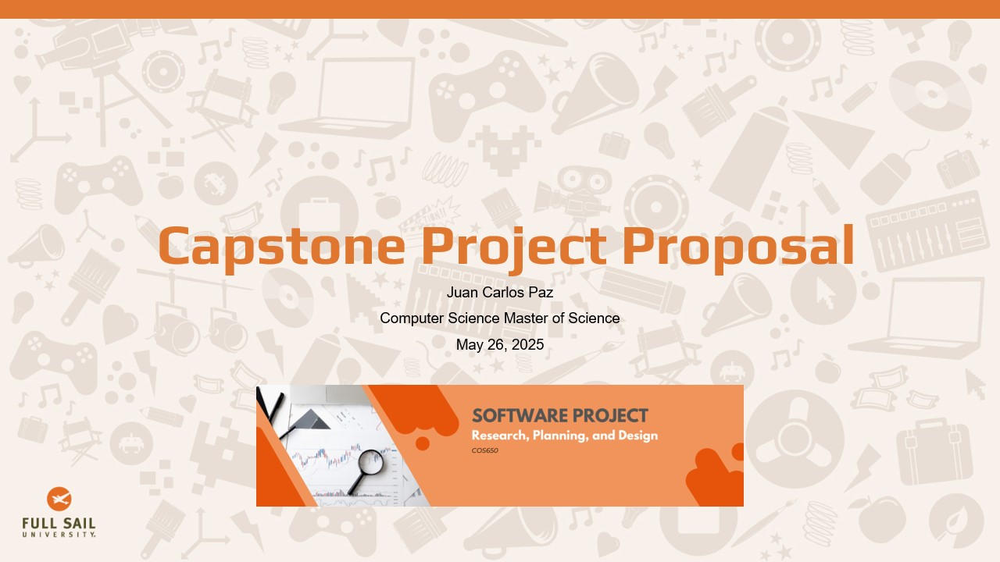
    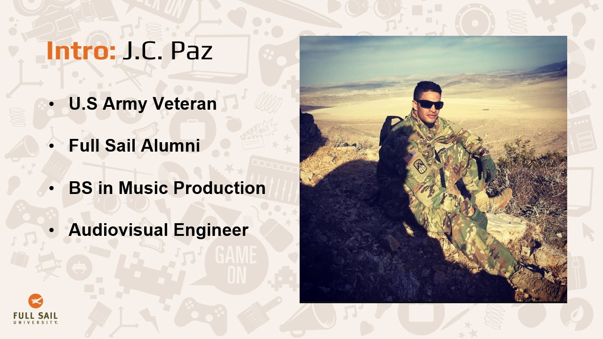
    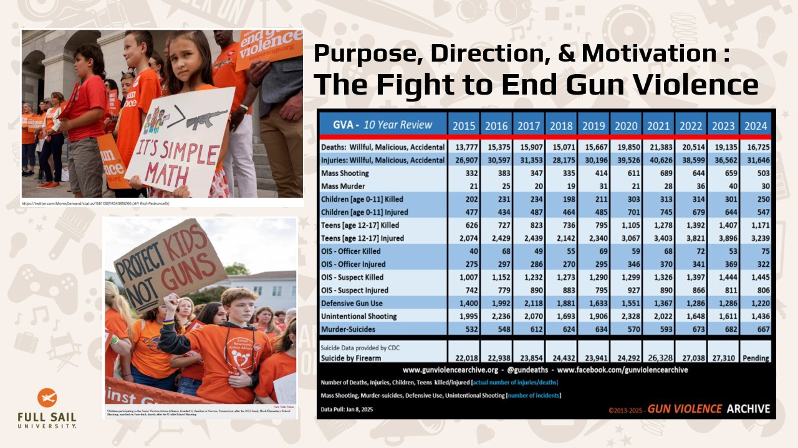
    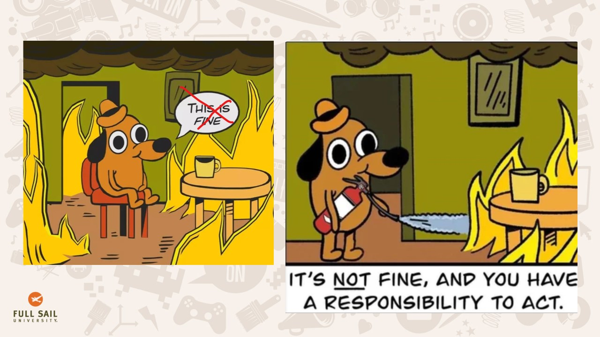
    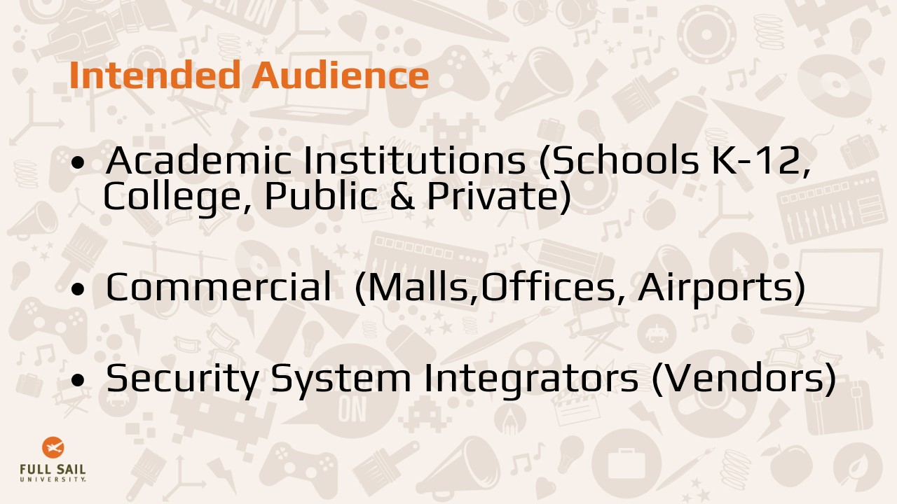
    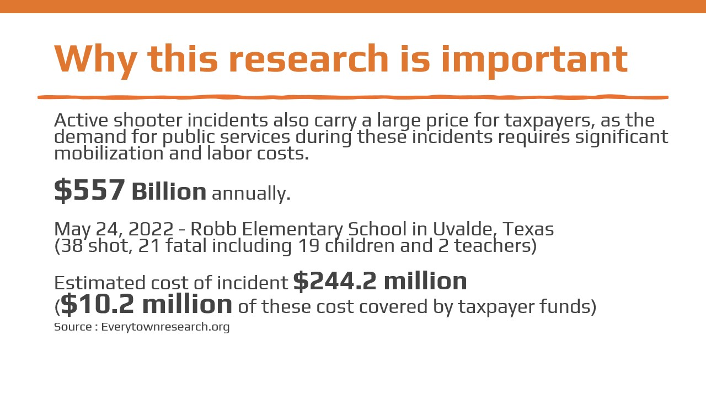
    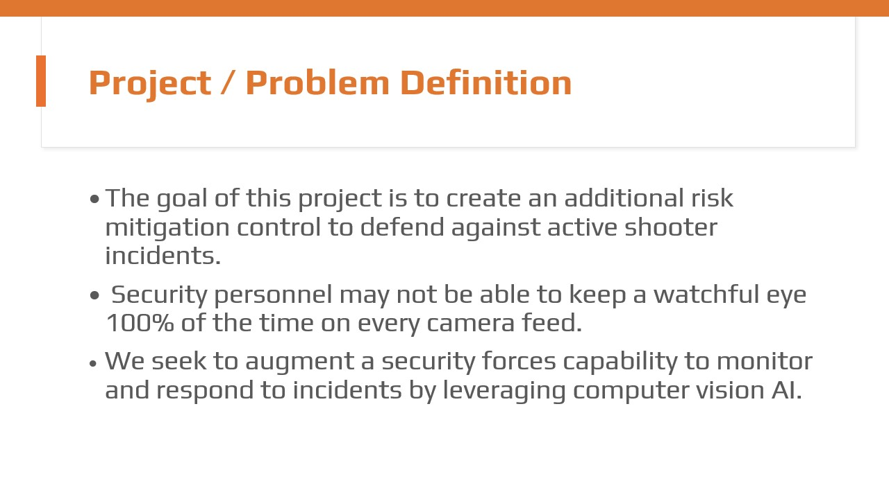
    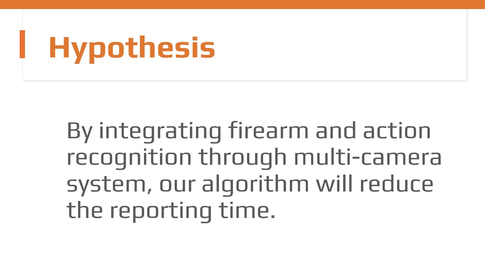
    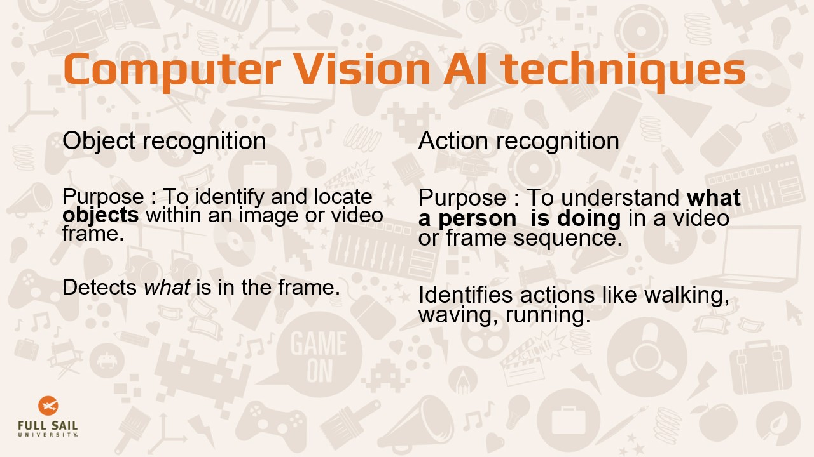
    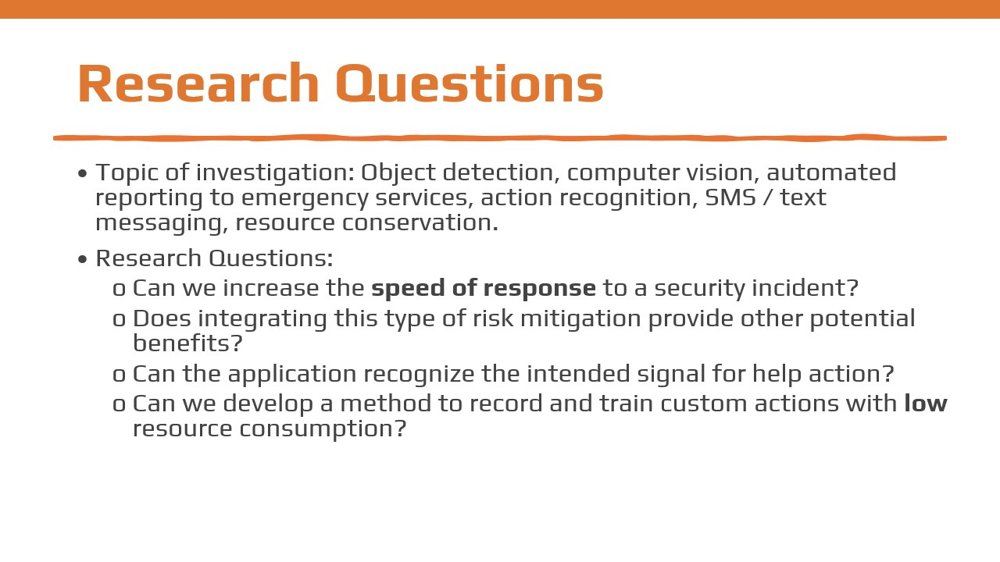
    
    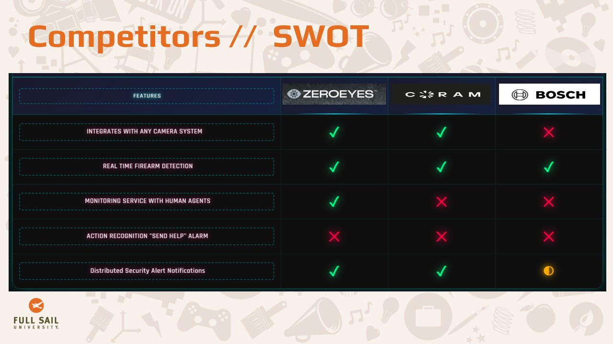
    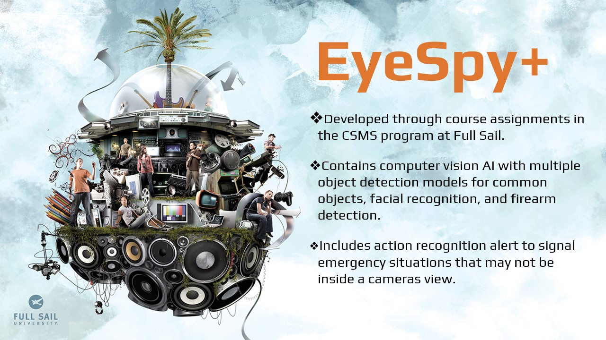
    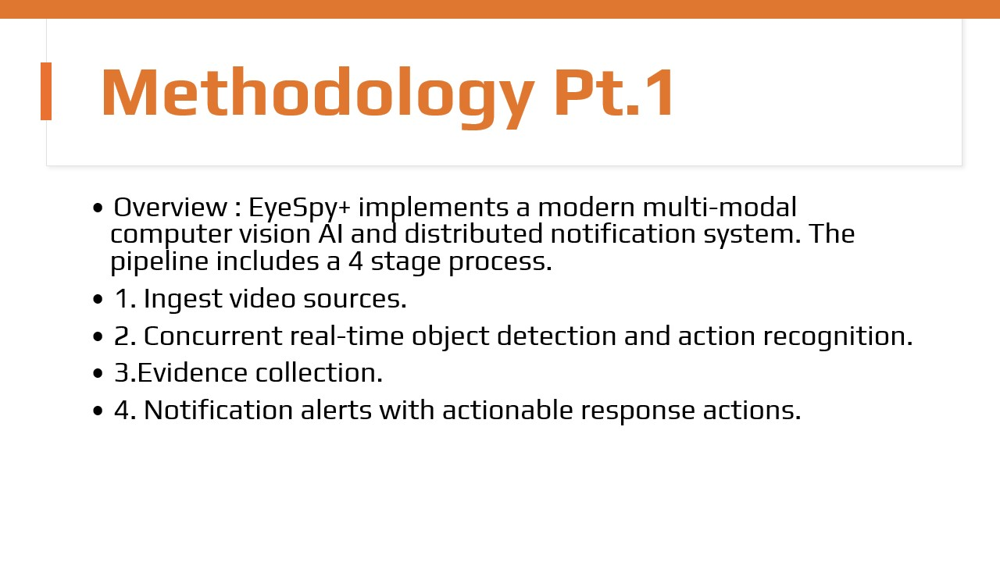
    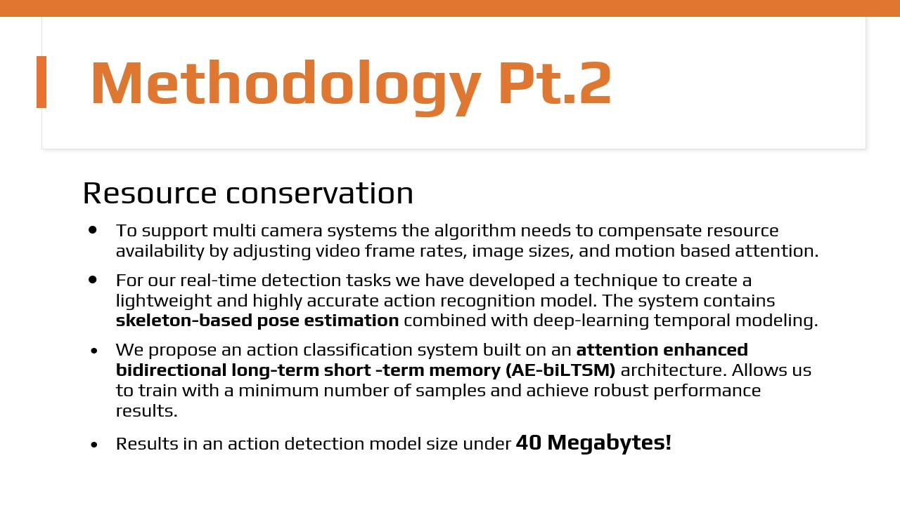
    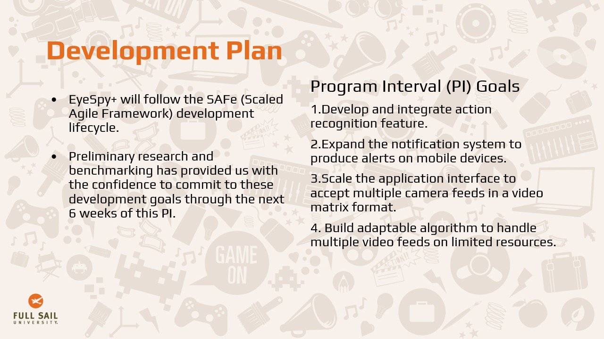
  

  
  <button class="prev" onclick="changeSlide(-1)">❮</button>
  <button class="next" onclick="changeSlide(1)">❯</button>
  
  

    1 / 16
  

## Monthly Development Blog

  <h3 class="post-title">Action Recognition Modeling and Integration</h3>
  
June 1, 2025 • By JCP

  <h4>Features Developed This Month</h4>
  
This month we developed a system to create and train action recognition models using MediaPipe, PyTorch, SciKitLearn and data augmentation techniques to produce accurate models with less than 50 samples. We were able to introduce the model we trained into the main application that performs object detection to integration action recognition and object detection in our main application "EyeSpy+".

  
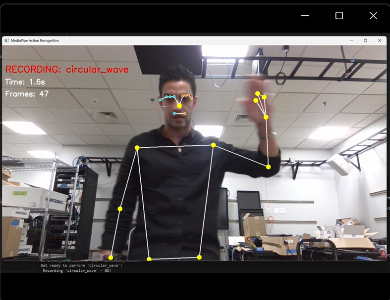

  <h4>Retrospective</h4>
  <h5>What went right this month?</h5>
  
This month we were fortunate to have a lot of time available to dedicate to our project due to our work schedule opening up time for us to work on our studies. Knowing how challenging it is to annotate images for model training from a previous project, we decided to make this the focus of the effort. Our efforts began by examining other action recognition projects and looking for trends in the model composition and sample types. Thanks to "Python Feature Engineering Cookbook" by Soledad Galli which was recommended further reading material from our Machine Learning course, we were able to find ways to augment the sample data (JSON format) by adding versions of each sample at different time scales, rotating the position of the base, introducing noise, and flipping the images through into our action recognition model training algorithm.

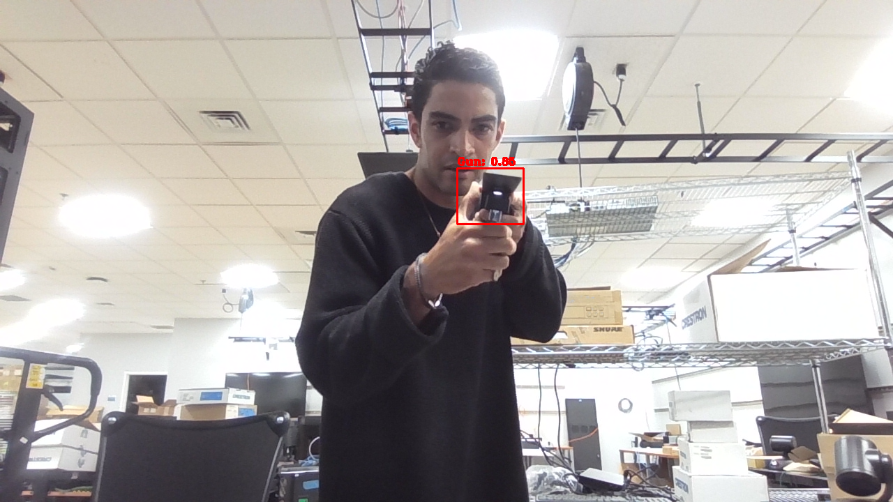  
  <h5>What went wrong this month?</h5>
  
Initially, we were not successful with the model training algorithm. Our approach was to train only a single action thinking this would be the most efficient way to produce a lightweight model. However, because we did not train the model on what an action is NOT - it was performing poorly by classifying each action as the same event, simply because there was motion. We then had issues with where our position was before we began the action we were training on. In moving to the starting position there was data being recorded that had nothing to do with the gesture we wanted to record. We solved this by creating a countdown timer to allow us to get into place and position before beginning the action. Finally, after adding 5 more actions to train on we reduced our false positive rate to an acceptable level and the model began performing with high confidence scores in the training and validation process.

  
When we attempted to integrate the action recognition feature into our main application we had to do quite a bit of troubleshooting to understand what variables were affecting each model's performance. The size of the video frame in the main application did not match the size of the training application. I assumed this was just a display setting, not something the models would consider when performing inference. Once I matched the main application size and frame rate to the action recognition model's training data we were able to get successful detections of both the action and object detection models.

  
Also, our Version 3 prototype performed great with just CPU processing. For this version we have had to leverage CUDA for performance enhancements since the action recognition and object detection concurrent inference tasks are not running optimally.

  <h5>How can you improve moving forward?</h5>
  
Going forward I will need to give a full effort to the development process. Right now the prototype works, but it seems to be very heavy on resource consumption.

